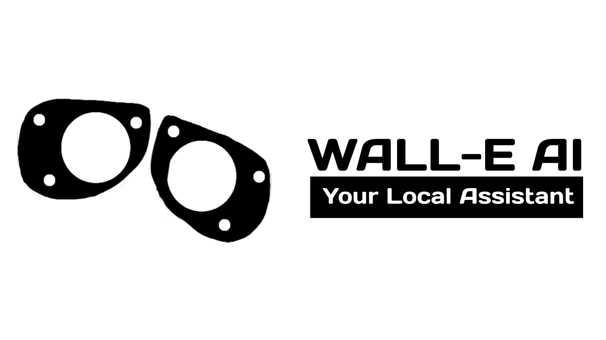
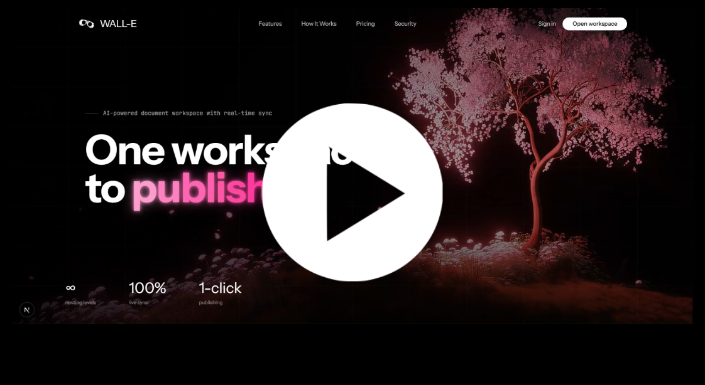
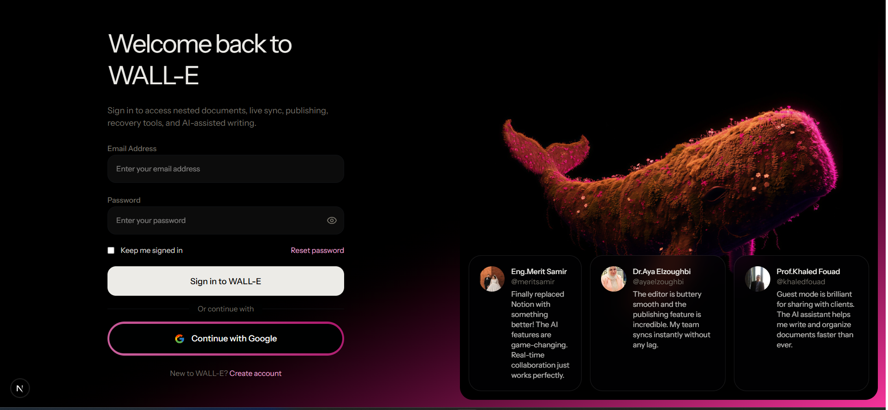
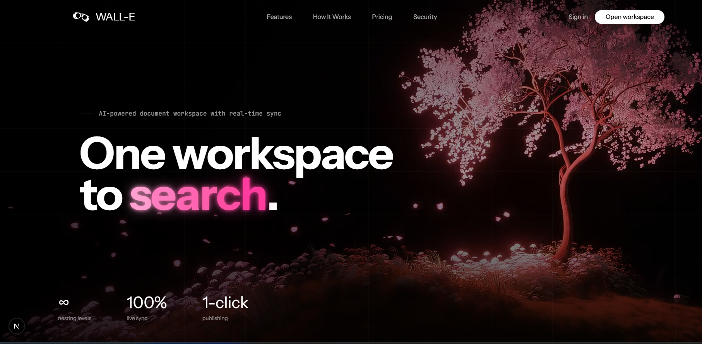

# WALL-E - AI-Powered Document Workspace
<p align="center">
    
  </p>
  
WALL-E is a fully-featured production-ready document workspace with AI capabilities, real-time collaboration, publishing, guest mode, and modern UI.

## Website demo
<p align="center">
  <a href="https://drive.google.com/file/d/1pgsp6nrcx1j3eDdtMuPxso-PAlLdrNRG/view">
    
  </a>
</p>
### Core Features

- ✅ **Document Management** - Create, read, update, archive documents with infinite hierarchical nesting and soft delete
- ✅ **Rich Editor** - BlockNote with full formatting, multiple content blocks, and drag-and-drop cover images
- ✅ **login page** - Google Gemini 2.5 Flash integration with streaming responses and tool calling

    
  
- ✅ **Real-Time Database** - Convex real-time sync across all clients automatically
- ✅ **Authentication** - Clerk OAuth/social login with JWT verification and guest mode
- ✅ **Responsive Site** - EdgeStore integration for cover images and file management

   


- ✅ **Publishing System** - Generate public URLs and share documents with read-only preview
- ✅ **Trash & Recovery** - Soft delete with full recovery options for documents
- ✅ **UI/UX** - Light/dark/system theme toggle, resizable sidebars, mobile responsive
- ✅ **Collaboration** - Real-time team collaboration with live updates and no manual refresh

## Getting Started

First, run the development server:

```bash
npm run dev
# or
yarn dev
# or
pnpm dev
```

Open [http://localhost:3000](http://localhost:3002) with your browser to see the result.

Sign-in redirects to [http://localhost:3000](http://localhost:3002) for local testing.

## Tech Stack

- **Framework**: Next.js 16 (React)
- **Database**: Convex (real-time backend)
- **Auth**: Clerk
- **Editor**: BlockNote
- **AI**: Google Gemini 2.5 Flash
- **File Storage**: EdgeStore
- **Styling**: Tailwind CSS
- **UI Components**: Shadcn/ui

## Features Breakdown

### 1. Document Management

- Create, read, update, archive documents
- Infinite hierarchical nesting
- Soft delete with trash system
- Real-time synchronization across clients
- Full-text search functionality

### 2. Rich Editor

- BlockNote editor with full formatting support
- Multiple content block types (paragraphs, checklists, tables)
- Cover image management with drag-and-drop upload
- Emoji icon picker for visual identification
- Inline title editing

### 3. AI Assistant

- Google Gemini 2.5 Flash integration
- Streaming chat responses
- AI tool calling (can insert content automatically)
- Extended thinking support
- Mobile-responsive sidebar (320-560px resizable)
- Debounced updates

### 4. Authentication

- Clerk OAuth/social login
- JWT-based user verification
- Role-based access control
- Guest mode with local storage persistence

### 5. Real-Time Database

- Convex real-time sync
- Live title, content, and metadata updates
- Automatic document tree refresh
- No manual refresh needed

### 6. File Storage

- EdgeStore integration
- Cover image uploads with validation
- File replacement and deletion
- Public file bucket access

### 7. Publishing System

- Publish documents to generate public URLs
- Read-only preview mode
- Share with copy URL button
- Unpublish capability

### 8. Trash & Recovery

- Soft delete with recovery options
- Permanent deletion
- Archive/restore hierarchy
- Trash box filtering

### 9. Guest Mode

- No login required
- Local browser storage persistence
- Full editor and AI access
- Auto-generated document IDs

### 10. UI/UX Features

- Light/dark/system theme toggle
- Resizable sidebars (drag-to-resize)
- Mobile responsive design
- Expandable document tree
- Keyboard shortcuts (Cmd+K search)
- Toast notifications
- Loading skeletons

## Learn More

- [Next.js Documentation](https://nextjs.org/docs)
- [Convex Documentation](https://docs.convex.dev)
- [Clerk Documentation](https://clerk.com/docs)
- [BlockNote Documentation](https://www.blocknote.dev)
